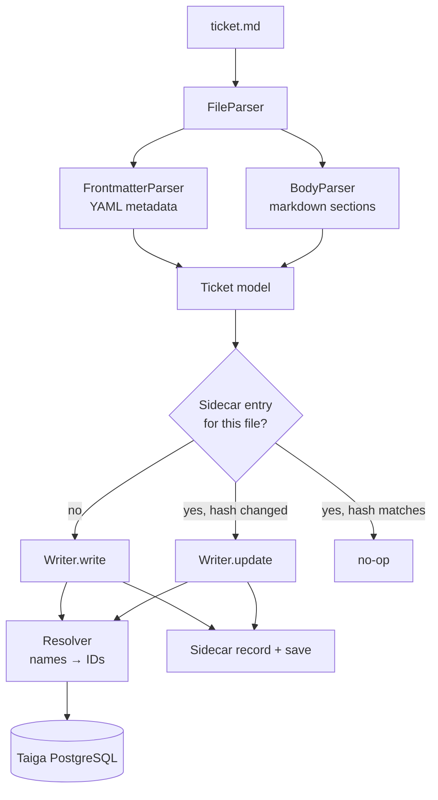

# Architecture

taigun is a pipeline: a markdown file goes in one end, SQL comes out the other.
There is no daemon, no cache, and no API client — each command opens a PostgreSQL
connection, does its work in a transaction, and exits.

## How a push flows

Each file in a push is handled in its own transaction — that is why a failing
file can be reported and skipped while the rest of the batch proceeds.

## Modules

| Module | Role |
|---|---|
| `cli.py` | Typer entry point — commands, prompts, output |
| `config.py` | Connection profiles (`~/.config/taigun/config.toml`) |
| `models.py` | Dataclasses for story, issue, task, epic, milestone |
| `parsers/frontmatter.py` | YAML frontmatter → metadata dict |
| `parsers/body.py` | Markdown body → subject + description |
| `parsers/file.py` | Orchestrates both parsers into a ticket model |
| `resolver.py` | Name → ID lookups: project, user, status, priority, severity, issue type, content types, parent story |
| `db/connection.py` | One connection per operation; commit on success, rollback on error |
| `db/base.py` | Shared writer logic — common field resolution, ref allocation |
| `db/story.py` `issue.py` `task.py` `epic.py` `milestone.py` | Per-type INSERT and UPDATE |
| `db/ref.py` | Per-project ref sequence + `references_reference` bookkeeping |
| `db/project.py` | Project create / update |
| `db/lister.py` | Read-only listings (projects, epics, statuses) |
| `db/update_helpers.py` | Conflict detection and field-cleared checks |
| `state.py` | Sidecar load / find / record / save |
| `exceptions.py` | Parse, resolve, conflict, and identity error types |

## Resolution and fallbacks

The resolver turns every human-readable name in a ticket file into a database ID,
scoped to the project. Unknown `status`, `priority`, `severity`, and `issue_type`
names warn and fall back to the project's default rather than failing the push;
unknown projects and users are hard errors.
